<a href="https://rakshit-737.is-a.dev">
  
</a>


<p align="center">
  <a href="https://rakshit-737.is-a.dev"></a>
  <a href="https://www.linkedin.com/in/rakshit-rameshbabu/"></a>
  <a href="mailto:rakshitoffl@gmail.com"></a>
  <a href="https://rakshit-737.is-a.dev/rakshit-rameshbabu-resume.pdf"></a>
  <a href="https://learn.cylabacademy.org/users/rrakshit"></a>
</p>

## <samp>❯ cat about.md</samp>

I'm a B.Tech CSE (Cyber Security) student at **VIT Chennai** (CGPA 9.07, class of 2028). I build **defensive security tooling** and **full-stack products**, and I take them end to end: written requirements, architecture, CI, then a release.

Every repo is held to one rule: **every number regenerates from one command.** That means public datasets, committed results, baselines run on identical inputs, and a *Limitations* section that says what does not work. The security tools are defensive and lab-safe: static where possible, sandboxed where not.

```yaml
# ~/.config/rakshit.yml
now:
  - wiring 13 detection / DFIR / CTI engines into one evidence graph   # throughline
  - Warden v2: supply-chain firewall for PyPI, manifests and images    # warden
  - taking Fillwright toward a Chrome Web Store release                # fillwright
research: ML job scheduling, reported as a negative result             # proactive-feasibility-scheduler
interests: [detection engineering, DFIR, supply-chain security, AI-agent security, post-quantum crypto]
open_to: internships & full-time roles in software / security engineering
```

## <samp>❯ ls ~/featured</samp>

> [!NOTE]
> Every number on these cards is copied from the linked repo's README or committed `results/`. Where a result is synthetic or simulated, the card says so.

<p align="center">
  <a href="https://github.com/rakshit-737/throughline"></a>
  <a href="https://github.com/rakshit-737/warden-supply-chain-security"></a>
  <a href="https://github.com/rakshit-737/nikasha"></a>
  <a href="https://github.com/rakshit-737/afterlock"></a>
  <a href="https://github.com/rakshit-737/anvil"></a>
  <a href="https://github.com/rakshit-737/sluice"></a>
  <a href="https://github.com/rakshit-737/proactive-feasibility-scheduler"></a>
  <a href="https://github.com/rakshit-737/docforge"></a>
  <a href="https://github.com/rakshit-737/fillwright"></a>
  <a href="https://github.com/rakshit-737/feelslike"></a>
</p>

## <samp>❯ throughline --map</samp>

Thirteen single-purpose security engines, each benchmarked on its own, plugged into one graph. [THROUGHLINE](https://github.com/rakshit-737/throughline) fuses them, so *what happened, how did it start, who did it, and how sure are we?* becomes one query.


<details>
<summary><b>open the full arsenal: every security repo, one measured headline each</b></summary>
<br/>

| domain | repo | headline (from the repo's own results) |
|---|---|---|
| detection engineering | [**ANVIL**](https://github.com/rakshit-737/anvil) | 461/461 evaluable SigmaHQ regression cases detected; 2,994,137 benign events replayed against 2,803 rules |
| purple team | [**GAUNTLET**](https://github.com/rakshit-737/gauntlet) | replays 96 real OTRF attack recordings through 2,519 SigmaHQ rules; ranked gaps and a CI regression gate |
| control coverage | [**VANTAGE**](https://github.com/rakshit-737/vantage) | CIS IG2 on classic Windows logs: 53.9% *claimed* ATT&CK coverage vs 11.2% *defended* |
| DFIR timelines | [**REVENANT**](https://github.com/rakshit-737/revenant) | confidence-graded incident stories; every claim cites the SHA-256 of its event; append-only custody ledger |
| attack reconstruction | [**ROOTLINE**](https://github.com/rakshit-737/rootline) | ATLAS S1–S4: event F1 0.559 vs 0.077 for IOC grep; graph reduction 3.8–4.4× with 100% of attack edges kept |
| attribution | [**DRAGNET**](https://github.com/rakshit-737/dragnet) | right group ranked first in 68% of 25 ATT&CK campaigns; never commits at MEDIUM+ to a wrong actor |
| CTI reasoning | [**OCCAM**](https://github.com/rakshit-737/occam) | under planted false flags, names the framed group 1.1% of the time vs 88.0% for TTP similarity |
| malware triage | [**VITRINE**](https://github.com/rakshit-737/vitrine) | EMBER 2018 temporal split: ROC AUC 0.9917, 74.5% TPR at 0.1% FPR; never executes a sample |
| malware pipeline | [**SPECIMEN**](https://github.com/rakshit-737/specimen) | static gate skips 42% of detonations, misses 1.2% of malware; 95.9% family accuracy on 48,976 CAPEv2 reports |
| NIDS robustness | [**FEINT**](https://github.com/rakshit-737/feint) | XGBoost at 99.7% clean accuracy detects 42% of flows under realisable evasion; adversarial training restores 80–96% |
| attack paths | [**LINCHPIN**](https://github.com/rakshit-737/linchpin) | exact minimum remediation cut over scanner, BloodHound and EPSS/KEV data; sends no packets |
| cloud-native | [**STRATUM**](https://github.com/rakshit-737/stratum) | F1 1.000 on 148 upstream PSS conformance pods; 32 of 87 real workloads not PSS-restricted |
| CI/CD provenance | [**TRACEGATE**](https://github.com/rakshit-737/tracegate) | finding → introducing commit: 97.5% (356/365) vs 17.3% for the best baseline |
| K8s containment | [**AFTERLOCK**](https://github.com/rakshit-737/afterlock) | Go collector + Python planner; live kind lab agrees with the model on 17/17 steps across 3 runs |
| supply chain | [**WARDEN**](https://github.com/rakshit-737/warden-supply-chain-security) | 14 static analyzers, SBOM + SARIF + CI gate; 2,908 backend tests in CI |
| vuln-report triage | [**NIKASHA**](https://github.com/rakshit-737/nikasha) | v0.1.0 on PyPI; 0/126 genuine curl reports falsely flagged (Wilson 95% upper bound 2.96%) |
| agent security | [**SLUICE**](https://github.com/rakshit-737/sluice) · [**taintwall**](https://github.com/rakshit-737/taintwall) | taintwall: exfiltration 43% → 0% with all four layers, benign utility held at 100% |
| state reconstruction | [**SPECTRA**](https://github.com/rakshit-737/spectra-security) | pre-alpha: a Python reference slice runs end to end; no milestone is green yet, and the README says so |

</details>

## <samp>❯ ls ~/also-built</samp>

- **[PlantPal+](https://github.com/rakshit-737/PlantPal-Plus)**: plant care, fitness and nutrition on one habit loop. TypeScript monorepo (Expo, React + Vite, Express, PostgreSQL) with an IEEE-830 requirements package: 228 FRs, 119 user stories, 89 use cases.
- **[RailMind](https://github.com/rakshit-737/Railmind)**: a digital twin of a 21-station railway network feeding LangGraph agents that score incident-response plans. Runs offline, no API keys.
- **[portfolio](https://github.com/rakshit-737/portfolio)**: a candlelit, scroll-driven Next.js site. CI gates Lighthouse, axe, CSP and link checks; accessibility, best-practices and SEO score 100.
- **[VIT CGPA Calculator](https://github.com/rakshit-737/cgpa-calculator)** · **[learn-sql](https://github.com/rakshit-737/learn-sql)** · **[PaceReader](https://github.com/rakshit-737/pace-reader)** · **[ZT Web Security Simulator](https://github.com/rakshit-737/web-security-simulator)**: small tools for studying and campus life.

## <samp>❯ which --all</samp>

<p align="center">
  <br/>
  <br/>
  
</p>


## <samp>❯ tail trophies.log</samp>


## <samp>❯ gh telemetry</samp>

<p align="center">
  
  
</p>

<picture>
  <source media="(prefers-color-scheme: dark)" srcset="https://raw.githubusercontent.com/rakshit-737/rakshit-737/main/profile-3d-contrib/profile-night-green.svg" />
  <source media="(prefers-color-scheme: light)" srcset="https://raw.githubusercontent.com/rakshit-737/rakshit-737/main/profile-3d-contrib/profile-green-animate.svg" />
  
</picture>

<picture>
  <source media="(prefers-color-scheme: dark)" srcset="https://raw.githubusercontent.com/rakshit-737/rakshit-737/main/generated/snake-dark.svg" />
  <source media="(prefers-color-scheme: light)" srcset="https://raw.githubusercontent.com/rakshit-737/rakshit-737/main/generated/snake-light.svg" />
  
</picture>

<details>
<summary><b>how this profile builds itself</b></summary>
<br/>

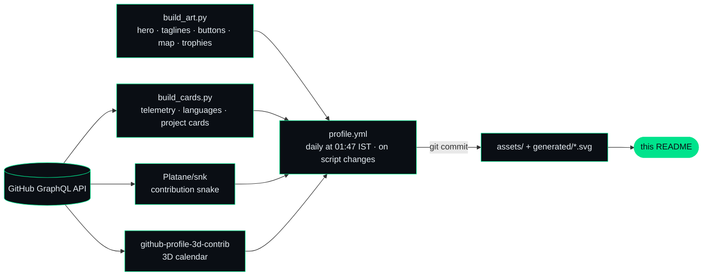

The hero, tagline banner, link buttons, toolchain, map, trophies log and footer are hand-built animated SVGs (`scripts/build_art.py`): SMIL only, no JavaScript, with a subset of JetBrains Mono embedded so they render the same on every OS, and every animation rests on its finished frame. The public instances of github-readme-stats, trophies and activity-graph now return 503/402, so the telemetry and language cards are generated here instead. Apart from the skill icons, every image on this page is served from this repo.

</details>

